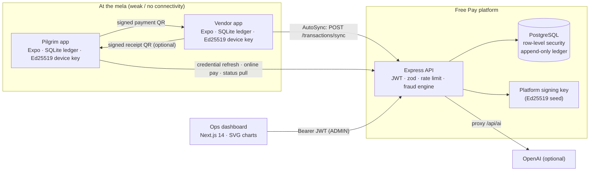
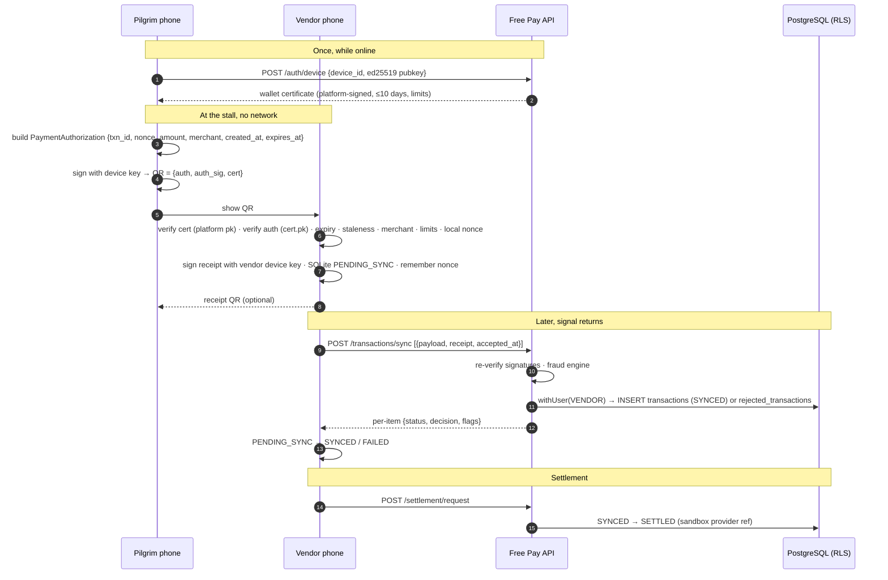
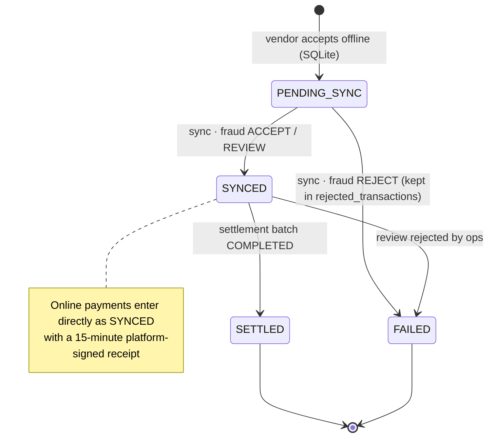
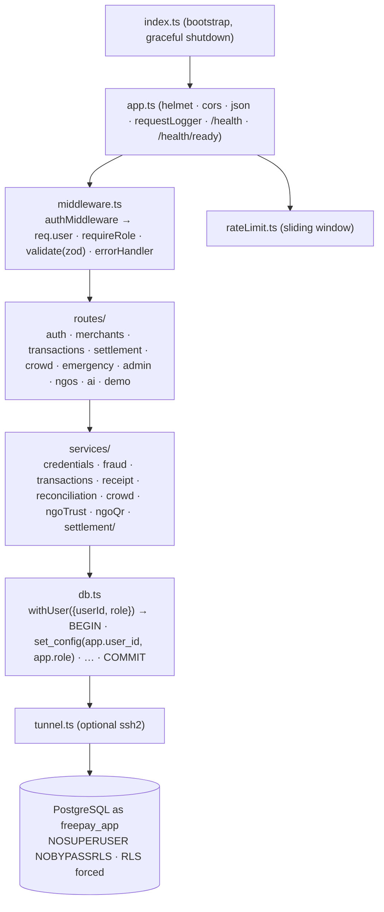
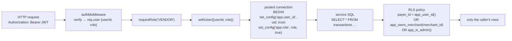
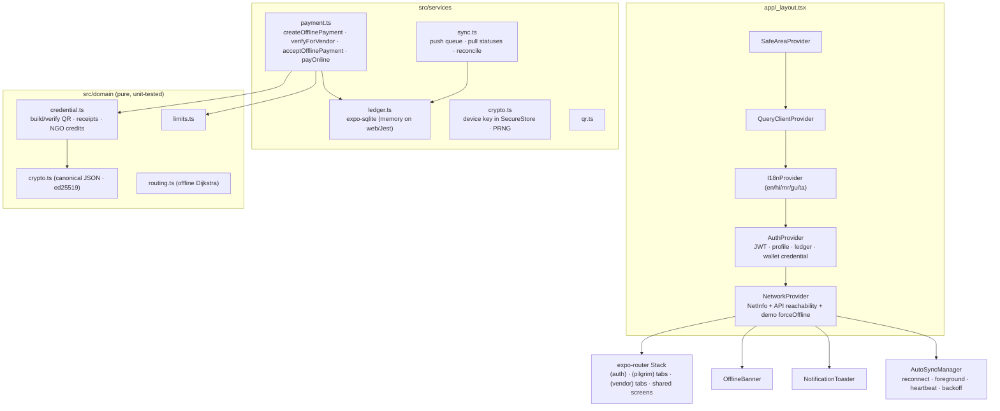

# Free Pay — Architecture

## 1. System overview

Three apps, one contract: the **protocol types** (`server/src/services/types.ts` and
`src/domain/types.ts`) and the **canonical JSON** signing rule are identical on both
sides; a fixture in each test-suite pins the byte-level encoding.

## 2. The offline payment loop

### What each side can and cannot verify

| Check | Vendor device (offline) | Server (on sync) |
| --- | --- | --- |
| Platform signature on credential | ✅ | ✅ |
| Device signature on authorisation | ✅ | ✅ |
| Certificate/authorisation expiry, ≤10-day staleness, tampered window | ✅ | ✅ (server clock is the backstop) |
| Merchant matches the scanning stall | ✅ | ✅ (`MERCHANT_MISMATCH`) |
| Per-payment cap and the credential's own limits | ✅ | ✅ |
| Rolling daily cap across **all** stalls | ❌ (cannot know other stalls) | ✅ (`EXCEEDS_DAILY_LIMIT`) |
| Replay of the same code at **this** stall | ✅ (local nonce table) | ✅ |
| Replay at a **different** stall | ❌ | ✅ (global nonce/txn-id uniqueness) |
| Device registered to the payer | ❌ | ✅ (soft flag `DEVICE_MISMATCH`) |
| Unknown merchant, velocity, review threshold | ❌ | ✅ |

## 3. Transaction lifecycle

The database trigger `transactions_append_only_guard` enforces this: financial columns
are immutable, `SETTLED`/`FAILED` are terminal, `DELETE` always raises `42501`.

## 4. Backend layering

### Fraud engine

`services/fraud.ts` is pure: the caller collects facts (nonce seen? txn id seen? merchant
known? device registered? payer's rolling-day offline total? recent count?) through
`SECURITY DEFINER` helper functions that return only booleans/aggregates, then
`evaluateTransaction(input, ctx, config)` returns `{decision, flags, suspicious}`.

| Severity | Flags | Effect |
| --- | --- | --- |
| HARD | `NON_POSITIVE_AMOUNT` `DUPLICATE_NONCE` `REPLAYED_TRANSACTION_ID` `EXPIRED_AUTHORIZATION` `STALE_OFFLINE_AUTHORIZATION` `TAMPERED_EXPIRY` `FUTURE_DATED` `EXCEEDS_SINGLE_TXN_LIMIT` `EXCEEDS_DAILY_LIMIT` `MERCHANT_MISMATCH` `INVALID_SIGNATURE` `INVALID_CERTIFICATE` `CERT_EXPIRED` … | **REJECT** — recorded in `rejected_transactions`, never in the ledger |
| SOFT | `UNKNOWN_MERCHANT` `DEVICE_MISMATCH` `VENDOR_DEVICE_UNREGISTERED` | accepted, `suspicious = true`, decision REVIEW |
| REVIEW | `ABOVE_REVIEW_THRESHOLD` (₹1,500) `HIGH_VELOCITY` | accepted, queued for ops |

All thresholds come from `FRAUD_*` env; the 10-day maximum age is a hard ceiling that
the env can lower but never raise.

## 5. Data isolation with row-level security

Key policies (`migrations/003_rls.sql`):

| Table | Pilgrim | Vendor | Admin | System (auth service only) |
| --- | --- | --- | --- | --- |
| `users` | own row | own row | all | lookup by phone, insert on register |
| `transactions` | own payments | own stall's | all (no financial edits) | — |
| `rejected_transactions` | — | own stall's | all | — |
| `settlements` | — | own stall's | all | — |
| `emergencies` | own | own | **only while `expires_at > now()`** | — |
| `crowd_zones`, `lost_persons`, `merchants` (directory), `ngos` | read | read | read/write | — |
| `audit_log` | append | append | read | append |

Cross-tenant facts the fraud engine needs are exposed through `SECURITY DEFINER`
functions (`app_nonce_exists`, `app_txn_exists`, `app_device_belongs_to`,
`app_payer_offline_total`, …) so a vendor can ask *"has this nonce been seen anywhere?"*
without being able to read anyone else's rows. `rls.test.ts` proves each of these rules
against a live database, including that the app role is not a superuser and every table
has RLS forced.

## 6. Mobile app structure

Design language: parchment surfaces, saffron as the single brand accent, kumkum red for
danger, tulsi green for success; serif display type for headings, system sans for body;
a floating tab bar with a raised saffron hero action (Scan / Accept).

## 7. Ops dashboard

`/admin` is a client-rendered Next.js app. `lib/useApi` polls the admin endpoints
(`/api/admin/overview`, `/analytics`, `/analytics/trends`, and per-tab lists) with a Bearer
JWT from `POST /api/auth/admin/login`. Charts are hand-built SVG (`components/charts`)
following a validated categorical palette (colour-vision-safe adjacent pairs, ≥3:1
contrast with direct labels where a hue is lighter), thin marks, hover tooltips and
legends for every multi-series chart. The chart geometry lives in `chartMath.ts` and is
unit-tested.

## 8. Extra capabilities

- **Crowd** — zones with capacity, density readings, a zone graph; `suggestRoute` runs
  Dijkstra with a congestion penalty and hard-avoids `CRITICAL` zones when any alternative
  exists. The same algorithm ships in the app for offline use on the cached graph.
- **Emergency** — `POST /emergency/sos` stores the SOS with `expires_at = now + 60 min`;
  the location trail (`emergency_locations`) is readable by responders only inside that
  window (RLS). The app queues an SOS offline, speaks reassurance in the user's language,
  and always shows the configurable contact numbers.
- **Lost person** — reports are visible to every authenticated user so volunteers can act;
  ops can mark found.
- **NGO trust + signed credits** — a transparent additive score (verification, tenure,
  redemption rate, volume, complaints); verified NGOs issue platform-signed meal/relief
  credits that vendors verify offline and the server redeems atomically.
- **AI assistant** — `POST /api/ai` proxies OpenAI with a Free Pay system prompt; the app
  falls back to a multilingual built-in FAQ offline or when no key is configured.

## 9. Configuration surface

All product rules are environment variables with identical defaults on both ends
(see README). Ports: API 4000, admin 3001, Metro 8081. PostgreSQL is reached directly or
through the optional SSH tunnel (`SSH_TUNNEL_ENABLED=true`).
